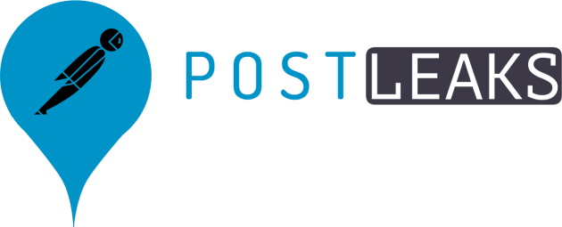
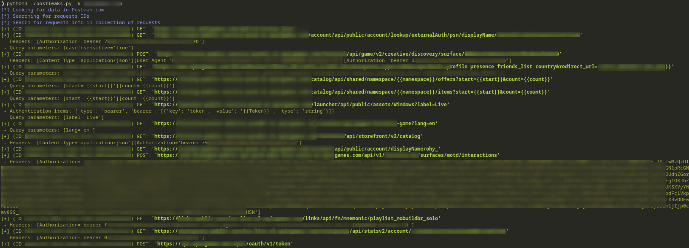

# Postleaks



## Description

[Postman](https://www.postman.com/home) is an awesome platform to build and use APIs, used by millions developers.  
It proposes also public API assets built by them which can contains custom endpoints and data. Unfortunately, these items can leak sensitive data about private websites and companies.  
This script is aimed to search for these pieces of information in Postman public library.

## Installation

```bash
pip3 install postleaks
```

or 

```bash
pip3 install .
```

## Recent Technical Changes

### Migration to curl_cffi
This fork of Postleaks uses `curl_cffi` instead of `requests` to bypass Cloudflare protection mechanisms.

### Browser Impersonation
You can specify which browser fingerprint to impersonate using the `--impersonate-browser` flag:

```bash
postleaks -k "coca-cola.com" --impersonate-browser chrome136
```

**Supported browsers**: chrome99, chrome100, chrome101, chrome104, chrome107, chrome110, chrome116, chrome119, chrome120, chrome123, chrome124, chrome126, chrome127, chrome131, chrome136, edge99, edge101, edge122, edge127, safari15_3, safari15_5, safari17_0, safari17_2_1, safari18_0

### Request ID Handling Changes
Postleaks output, including JSON filenames, contain the full Request ID. This Request ID can be used with [porch-pirate](https://github.com/MandiantThreatIntel/porch-pirate).

## Usage

```bash
❯ postleaks -h
usage: postleaks [-h] [-k KEYWORD] [-kf KEYWORD_FILE] [--extend-workspaces] [--strict] [--include INCLUDE] [--exclude EXCLUDE] [--raw] [--output OUTPUT] [--impersonate-browser {chrome99,chrome100,chrome101,chrome104,chrome107,chrome110,chrome116,chrome119,chrome120,chrome123,chrome124,chrome126,edge99,edge101,edge127,safari15_3,safari15_5,safari17_0,safari18_0}]

Postleaks 🚀💧 Search for sensitive data in Postman public library.

options:
  -h, --help            show this help message and exit
  -k KEYWORD            Keyword (Domain, company, etc.)
  -kf KEYWORD_FILE      File containing keywords (one per line)
  --extend-workspaces   Extend search to Postman workspaces linked to found requests (warning: request consuming and risk of false positive)
  --strict              Only include results where keywords are in the URL (warning: could miss some results where the final URL is a variable)
  --include INCLUDE     URL should match this string
  --exclude EXCLUDE     URL should not match this string
  --raw                 Display raw filtered results as JSON
  --output OUTPUT       Store JSON in specific output folder (Default: results_<TIMESTAMP>)
  --impersonate-browser {chrome99,chrome100,chrome101,chrome104,chrome107,chrome110,chrome116,chrome119,chrome120,chrome123,chrome124,chrome126,edge99,edge101,edge127,safari15_3,safari15_5,safari17_0,safari18_0}
                        Browser to impersonate for requests (requires curl_cffi). Helps bypass Cloudflare protection. (default: Chrome120)
```

*The results are available in `results_<TIMESTAMP>` subfolder. The filename is the request identifier in Postman.com*

## Example



## Limitations

**~~02/2024: Postman.com is limiting the results to 300 items (page size of 100 / offset of 200).~~**  
**12/2024: Postman.com is limiting the results to 225 items (page size of 25 / offset of 200).**

## Notes

Secret detection is done with [whispers](https://github.com/adeptex/whispers). Rules are stored in `config.yml` file.
